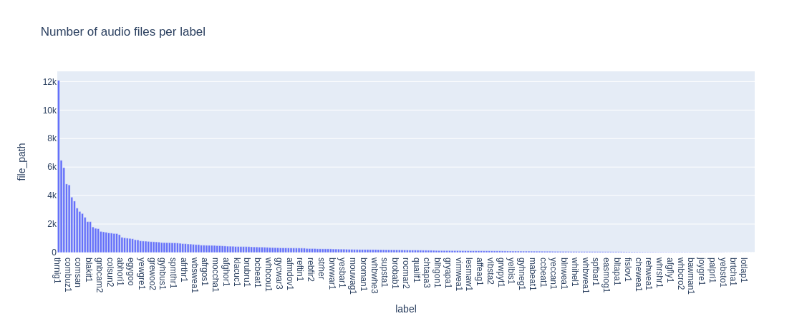
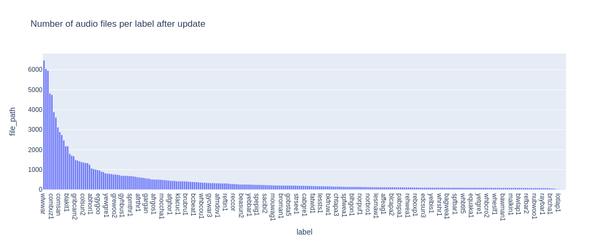
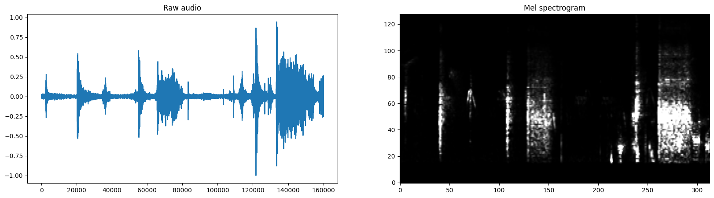
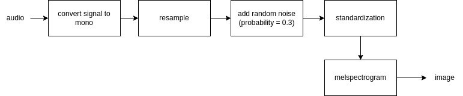
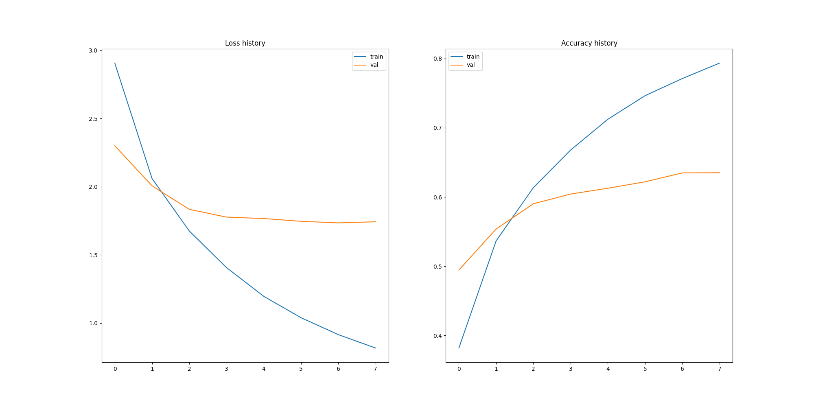

# Bird clef 2023

## Group

- Crevoiserat David
- El boudiri Anasse

## Project Description

Kaggle competitions [here](https://www.kaggle.com/competitions/birdclef-2023/overview) which consists in creating a bird classification model from audio recordings. The dataset used is the [BirdCLEF 2023](https://www.kaggle.com/competitions/birdclef-2023/data).

## Project Structure

The project is structured as follows:

birdclef2023 :

- data/
  - birdclef data (download [HERE](https://www.kaggle.com/competitions/birdclef-2023/data))
- model/
  - pytorch classification model ".pth"
- src/
  - python code

## Setup

To setup the project, you need to install the requirements :

```bash
pip install -r requirements.txt
```

or with pipenv :

```bash
pip install pipenv
pipenv shell
pipenv install
```

## Process

The whole process is available in the notebook birdclef2023.ipynb.

### 1. Data processing

- Data splitting

The data provided to us is in the form of several audio files of different durations. We therefore decided to split them into several 5-second files. We created a python script that allows us to do this. The script is available in `src/split_audio.py`.

The script takes as input the path to the directory containing the audio files and the path to the directory where the split files will be saved. It records new audio files, if the remaining time is less than 5 seconds, it does not record the remaining time. We could have done a padding to not lose information, but we preferred not to do it.


- Data distribution

We noticed that the classes are unbalanced.



We decided to oversample the minority classes and undersample the majority classes. This allowed us to have a more balanced distribution.



Our main objective was specifically to reduce the number of individuals in the most represented class, which we achieved by decreasing it by 50% (randomly eliminating half of the individuals). Of course, we also increased the number of individuals in the less represented classes by duplicating them. There are more efficient methods for doing this, but given the nature of the dataset, we preferred this approach.

Label Management
We needed to perform multi-label classification. Therefore, we decided to transform the labels into one-hot encoding to avoid problems during training.

Feature Extraction / Data Processing
To process the audio data, we decided to use the mel spectrogram of the audio to enable the use of CNNs.

More information on mel spectogram [here](https://medium.com/analytics-vidhya/understanding-the-mel-spectrogram-fca2afa2ce53)



Data Pipeline :



One advantage with images is the ability to perform data augmentation to further increase the amount of training data available. However, given the computing resources we have at our disposal, we decided not to perform data augmentation. (We tried, but we encountered issues with memory / execution time).

Data Split into Train/Validation
We divided the data into train and validation sets with an 85/15 ratio. We chose not to use test data because we used the Kaggle leaderboard to evaluate our model.

Furthermore, we used the 'stratify' parameter to ensure a balanced class distribution in both the train and validation data.

### 2. Model

We chose not to start from scratch, but rather to use Transfer Learning with a pre-trained model. We therefore used the [EfficientNet](https://huggingface.co/docs/timm/models/efficientnet) model which is a very performant for image classification and already trained on ImageNet database. We used the b3 version of the model.

The Pytorch framework is used to train the model. The training time being very long (~1h per epoch), we limited the training to 8 epochs.

Due to lack of time, we were not able to do hyperparameter tuning. We therefore used the default parameters of the model. Moreover, we did not add significant layers to the model, we just added a classification layer at the end of the model.

### 3. Results

- Loss during training



We notice that there is a beginning of overfitting from epoch 3.

- Metrics on validation data

| Accuracy | Precision | Recall | F1-score |
| -------- | --------- | ------ | -------- |
| 0.76     | 0.76      | 0.74   | 0.80     |

- Kaggle leaderboard

We unfortunately could not submit our model to Kaggle, due to lack of time and attempts (5 attempts per day). So we don't know if our model is performing well on test data or not.
